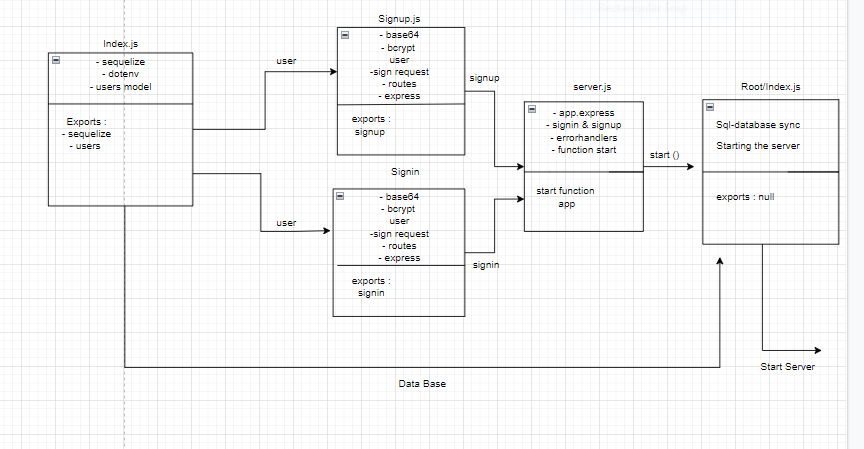

# basic-auth

- I created 2 routes one for signin & the other for signup and I make sure that the user is authorized .

## Uml Diagram :

## Links :
* [heroku app](https://basic-auth-deploy.herokuapp.com/)
* [pull request link](https://github.com/bushraAD98/basic-auth/pull/3)
* [ Actions link](https://github.com/bushraAD98/basic-auth/actions/runs/1947470108)

